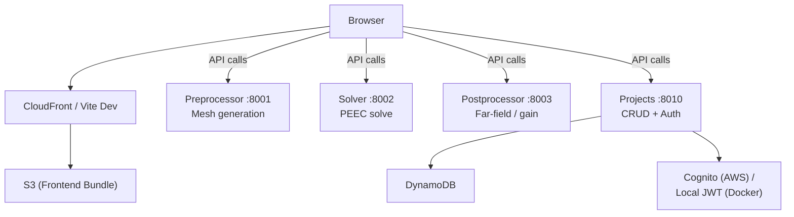

# Antenna Educator

[](https://github.com/baumgpaul/AntennaEducator/actions/workflows/pr-checks.yml)
[](LICENSE)

Cloud-native electromagnetic simulation platform based on the PEEC (Partial Element Equivalent Circuit) method. Python microservice backend, React frontend, deployed to AWS Lambda or run locally via Docker.

**Live:** [antennaeducator.nyakyagyawa.com](https://antennaeducator.nyakyagyawa.com)

## Features

- **Antenna design** — dipole, loop, helix, rod, custom wire geometries with lumped elements (RLC)
- **PEEC solver** — full-wave EM analysis: impedance, currents, frequency sweeps
- **Postprocessing** — far-field/near-field, radiation patterns, directivity, gain
- **3D visualization** — interactive Three.js scene with current/field overlays
- **Multi-view results** — up to 10 independent result views (3D + line plots)
- **Dual deployment** — serverless on AWS (~$1.60/month at low usage) or Docker on-prem

## Architecture



| Service | Port | Lambda | Purpose |
|---|---|---|---|
| **Preprocessor** | 8001 | `antenna-simulator-preprocessor-staging` | Geometry definition, mesh generation |
| **Solver** | 8002 | `antenna-simulator-solver-staging` | PEEC EM solver (impedance, currents) |
| **Postprocessor** | 8003 | `antenna-simulator-postprocessor-staging` | Far-field, near-field, directivity |
| **Projects** | 8010 | `antenna-simulator-projects-staging` | Project CRUD, auth, persistence |

## Tech Stack

| Layer | Technologies |
|---|---|
| **Backend** | Python 3.11+, FastAPI, NumPy, SciPy, Pydantic v2 |
| **Frontend** | React 18, TypeScript, Vite, MUI 5, Redux Toolkit, Three.js |
| **Infrastructure** | AWS Lambda (containers), DynamoDB, S3, CloudFront, Cognito, Terraform |
| **Dev tools** | pytest, Vitest, Black, isort, ruff, pre-commit |

## Quick Start

### Docker (full stack)

```bash
cp .env.example .env          # then set JWT_SECRET_KEY, ADMIN_EMAIL, ADMIN_PASSWORD
docker compose up -d
python scripts/init_local_db.py      # seed admin user + DynamoDB table
# Frontend: http://localhost:5173
```

See [docs/LOCAL_DEVELOPMENT.md](docs/LOCAL_DEVELOPMENT.md) for full setup with DynamoDB Local, MinIO, environment variables, and troubleshooting.

### Local development (services individually)

```bash
# Backend
python -m venv .venv && .venv\Scripts\activate    # Windows
pip install -e ".[dev]"
uvicorn backend.preprocessor.main:app --port 8001 --reload
# ... repeat for solver (8002), postprocessor (8003), projects (8010)

# Frontend
cd frontend && npm install && npm run dev          # http://localhost:5173
```

## Testing

### Local

```bash
# Backend unit tests
pytest tests/unit/ -x -q                   # Fast unit tests (~950 tests)
pytest -m critical -v                      # Gold-standard dipole validation

# Frontend
cd frontend && npx vitest run              # Vitest unit suite
cd frontend && npx tsc --noEmit            # TypeScript check
```

The **half-wave dipole gold standard** test validates solver correctness against fundamental antenna theory (~73 Ω impedance, ~2.15 dBi directivity).

### AWS (staging)

```bash
# Deploy to staging
.\scripts\deploy.ps1 -Environment staging

# Smoke-test all four Lambda endpoints
python dev_tools/test_aws_pipeline.py

# Tail CloudWatch logs
aws logs tail /aws/lambda/antenna-simulator-projects-staging --follow --profile antenna-staging
```

## Project Structure

```
AntennaEducator/
├── backend/                  # Python microservices
│   ├── preprocessor/         # Geometry & mesh generation
│   ├── solver/               # PEEC electromagnetic solver
│   ├── postprocessor/        # Field computation & analysis
│   ├── projects/             # Project CRUD & auth endpoints
│   ├── auth/                 # Standalone auth service (Docker only)
│   └── common/               # Shared models, auth, constants, repositories
├── frontend/                 # React + TypeScript + Vite
│   └── src/
│       ├── api/              # Axios client layer (per service)
│       ├── features/         # Feature-based components (design, results, ...)
│       └── store/            # Redux slices (auth, projects, design, solver, ...)
├── scripts/                  # Deployment & init scripts
│   ├── deploy.ps1 / .sh      # Unified Lambda + frontend deploy
│   ├── promote.ps1           # Promote staging images to production
│   └── init_local_db.py      # Seed DynamoDB + MinIO for local dev
├── terraform/                # AWS infrastructure-as-code
│   ├── environments/staging/ # Staging environment config
│   └── modules/              # Reusable Terraform modules
├── tests/                    # Backend test suite (pytest)
├── dev_tools/                # Ad-hoc test & smoke-test scripts
├── docs/                     # Documentation
└── docker-compose.yml        # Full-stack local orchestration
```

## Documentation

| Document | Description |
|---|---|
| [Local Development](docs/LOCAL_DEVELOPMENT.md) | Docker Compose, DynamoDB Local, MinIO, running services |
| [AWS Deployment](docs/AWS_DEPLOYMENT.md) | Terraform, Lambda deployment, frontend deploy, smoke tests |
| [Contributing](CONTRIBUTING.md) | Branching strategy, code style, PR workflow |
| [Backend Implementation](docs/BACKEND_IMPLEMENTATION.md) | Technical design and solver internals |
| [Reference Verification](docs/REFERENCE_VERIFICATION.md) | Solver validation against reference PEEC results |

## License

MIT — see [LICENSE](LICENSE). Copyright © 2026 Paul Baumgartner.

## Contact

Paul Baumgartner — baumg.paul@gmail.com
